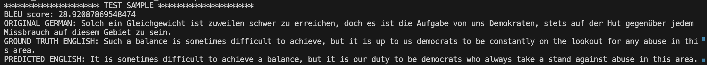

# Transfomer-Scratch-Pytorch
Transformer from '<em>**Attention is all you need**</em>' implemented from scratch in Pytorch.

For training, I use the Europarl German-English training corpus. By training the transformer for 10 epochs, I roughly observe around 25-30 BLEU score, which is in the expected range of the original paper (28.4 BLEU score). The corpus can be downloaded [here](https://www.statmt.org/europarl/v7/de-en.tgz). For more language pair data, one can check [this link](https://www.statmt.org/europarl/)

## Transformer parameter values
Model dimension <code>**(d_model)**</code> = 512

Number of Attention Heads <code>**(n_heads)**</code> = 8

Number of Encoders <code>**(num_encoder_layers)**</code> = 4

Number of Decoders <code>**(num_decoder_layers)**</code> = 4

Maximum sequence length <code>**(max_len)**</code> = 128

Feedforward layer hidden size <code>**(dim_feedforward)**</code> = 2048

Vocabulary size <code>**(vocab_size)**</code> = 37000 (same as original paper)

Batch size <code>**(batch_size)**</code> = 64
************************************
**TOTAL PARAMETER COUNT** ≈ 86M

## Steps to run
1. Download and extract the europarl german-english corpus. It should have two files, one for german and other for english.

2. Run <em>input_processing.py</em> to generate tokenizers and dataset for training. 

3. Run <em>main.py</em> to train the Transformer model and store it at checkpoints. With default setting, it runs for 10 epochs and is checkpointed every 2 epochs. The user can change this as needed. Also, with the above model setting, the training roughly takes 12.1GB of GPU memory on an NVIDIA RTX 4090 GPU.

4. Run <em>translation_test.py</em> to check the BLEU score per batch (batch size reduced to 32 to save GPU memory).

## Results
From the sample result below, we can see that the Transformer model trains fairly well with similar BLEU score as the original paper. 

